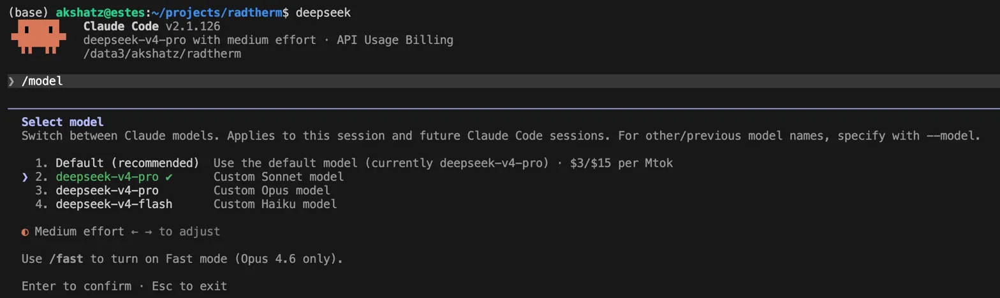

# 🤖 deep-seek-with-claude-code


Use Claude Code, the best AI coding agent on the market, with much cheaper model backends like DeepSeek V4.

---

## Claude Code

Claude Code is Anthropic's terminal-native AI coding agent. It lives in your terminal, reads your entire codebase, writes and edits files, runs commands, manages git — all through natural language. I have started using it recently and genuinely think it's one of the most powerful tools available if you write code professionally.

### Installation
Follow the official installation guide for your platform (macOS, Windows, Linux):
[code.claude.com/docs/en/setup](https://code.claude.com/docs/en/setup)

Once you have `claude` running in your terminal, come back here.

---

## Adding DeepSeek as Your Backend

By default, Claude Code uses Anthropic's own models — which are excellent but can get expensive at scale. Claude Code supports custom model backends via environment variables. Because DeepSeek exposes an **Anthropic-compatible API**, you can redirect all traffic there — no code changes, same CLI, same workflow.

### Step 1 — Get a DeepSeek API key

1. Sign up at [platform.deepseek.com](https://platform.deepseek.com)
2. Go to **API Keys** → **Create new key**
3. New accounts get **5M free tokens** (valid 30 days) — enough to experiment before committing

### Step 2 — Add shell functions

Add these to your `~/.zshrc` or `~/.bashrc`:

```bash
# -----------------------------------------------
# Store your DeepSeek API key
# -----------------------------------------------
export DEEPSEEK_API_KEY="sk-your-deepseek-key-here"

# -----------------------------------------------
# DeepSeek V4 — flagship, near-Opus quality
# -----------------------------------------------
deepseek() {
  export ANTHROPIC_BASE_URL="https://api.deepseek.com/anthropic"
  export ANTHROPIC_AUTH_TOKEN="${DEEPSEEK_API_KEY}"
  export ANTHROPIC_DEFAULT_OPUS_MODEL="deepseek-v4-pro"
  export ANTHROPIC_DEFAULT_SONNET_MODEL="deepseek-v4-pro"
  export ANTHROPIC_DEFAULT_HAIKU_MODEL="deepseek-v4-flash"
  export CLAUDE_CODE_SUBAGENT_MODEL="deepseek-v4-flash"
  export CLAUDE_CODE_DISABLE_NONESSENTIAL_TRAFFIC=1
  claude "$@"
}

# -----------------------------------------------
# DeepSeek V4 Flash only — budget/speed mode
# -----------------------------------------------
deepseek_fast() {
  export ANTHROPIC_BASE_URL="https://api.deepseek.com/anthropic"
  export ANTHROPIC_AUTH_TOKEN="${DEEPSEEK_API_KEY}"
  export ANTHROPIC_DEFAULT_OPUS_MODEL="deepseek-v4-flash"
  export ANTHROPIC_DEFAULT_SONNET_MODEL="deepseek-v4-flash"
  export ANTHROPIC_DEFAULT_HAIKU_MODEL="deepseek-v4-flash"
  export CLAUDE_CODE_SUBAGENT_MODEL="deepseek-v4-flash"
  export CLAUDE_CODE_DISABLE_NONESSENTIAL_TRAFFIC=1
  claude "$@"
}

# -----------------------------------------------
# Back to official Anthropic models
# -----------------------------------------------
claude_official() {
  unset ANTHROPIC_BASE_URL
  unset ANTHROPIC_AUTH_TOKEN
  unset ANTHROPIC_DEFAULT_OPUS_MODEL
  unset ANTHROPIC_DEFAULT_SONNET_MODEL
  unset ANTHROPIC_DEFAULT_HAIKU_MODEL
  unset CLAUDE_CODE_SUBAGENT_MODEL
  unset CLAUDE_CODE_DISABLE_NONESSENTIAL_TRAFFIC
  claude "$@"
}
```

### Step 3 — Reload your shell

```bash
source ~/.zshrc   # or source ~/.bashrc
```

### Step 4 — Use it

```bash
deepseek              # Start Claude Code with DeepSeek V4 Pro
deepseek_fast         # Start with DeepSeek V4 Flash (cheapest)
claude_official       # Start with official Anthropic models

# All Claude Code flags still work:
deepseek --continue           # Resume last session
deepseek -p "fix the tests"   # Non-interactive one-shot
```

**Verify it's routing correctly:**
```bash
echo $ANTHROPIC_BASE_URL
# → https://api.deepseek.com/anthropic

echo $ANTHROPIC_DEFAULT_OPUS_MODEL
# → deepseek-v4-pro
```

Check actual usage at [platform.deepseek.com](https://platform.deepseek.com) → **Usage**. The Claude Code UI may show Anthropic's prices as a label — ignore those, your actual bill is at DeepSeek's rates.

---

## Why DeepSeek V4?

### Performance

DeepSeek V4 Pro is the strongest open-weight model available today. On SWE-bench Verified — the standard benchmark for real-world software engineering — it scores **80.6%**, within 0.2 points of Claude Opus 4.6's 80.8%. It also leads on Codeforces (ELO 3206, beating GPT-5.5) and Terminal-Bench 2.0.

- [LiveCodeBench Leaderboard](https://livecodebench.github.io/leaderboard.html)
- [SWE-bench Leaderboard](https://www.swebench.com)
- [Artificial Analysis Leaderboard](https://artificialanalysis.ai)
- [DeepSeek V4 Tech Report](https://huggingface.co/deepseek-ai/DeepSeek-V4-Pro/blob/main/DeepSeek_V4.pdf)

### Pricing vs Anthropic's Built-in Models

| Model | Input | Output | Role in Claude Code |
|---|---|---|---|
| Claude Opus 4.7 | $5.00 / MTok | $25.00 / MTok | Default heavy model (Opus slot) |
| Claude Sonnet 4.6 | $3.00 / MTok | $15.00 / MTok | Default everyday model (Sonnet slot) |
| Claude Haiku 4.5 | $1.00 / MTok | $5.00 / MTok | Default fast model (Haiku slot) |
| **DeepSeek V4 Pro** | **~$0.44 / MTok** | **~$0.87 / MTok** | Replaces Opus + Sonnet slots |
| **DeepSeek V4 Flash** | **$0.14 / MTok** | **$0.28 / MTok** | Replaces Haiku + subagent tasks |

In my limited experience, DeepSeek V4 Pro handles agentic coding tasks extremely well, good enough that I use it as my default now. That said, if you're doing something that needs deep multi-step reasoning or precise factual recall, I'd switch back to Anthropic's models. For everyday coding though, the quality difference is hard to notice and the cost difference is hard to ignore.

---

## Resources

| Resource | Link |
|---|---|
| Claude Code Docs | [code.claude.com/docs](https://code.claude.com/docs) |
| Claude Code GitHub | [github.com/anthropics/claude-code](https://github.com/anthropics/claude-code) |
| DeepSeek API Docs | [api-docs.deepseek.com](https://api-docs.deepseek.com) |
| DeepSeek Platform | [platform.deepseek.com](https://platform.deepseek.com) |
| DeepSeek V4 Tech Report | [Hugging Face](https://huggingface.co/deepseek-ai/DeepSeek-V4-Pro/blob/main/DeepSeek_V4.pdf) |
| SWE-bench Leaderboard | [swebench.com](https://www.swebench.com) |
| LiveCodeBench | [livecodebench.github.io](https://livecodebench.github.io/leaderboard.html) |
| Artificial Analysis | [artificialanalysis.ai](https://artificialanalysis.ai) |
| Anthropic Pricing | [anthropic.com/pricing](https://www.anthropic.com/pricing) |
| DeepSeek Pricing | [api-docs.deepseek.com/quick_start/pricing](https://api-docs.deepseek.com/quick_start/pricing) |
